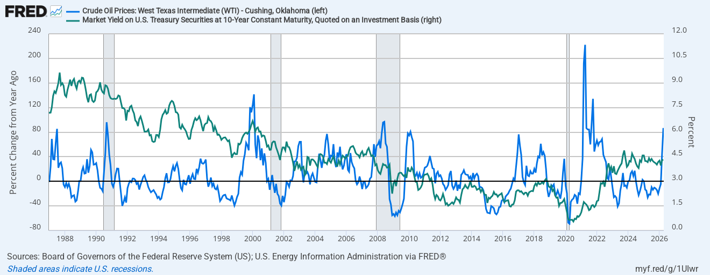
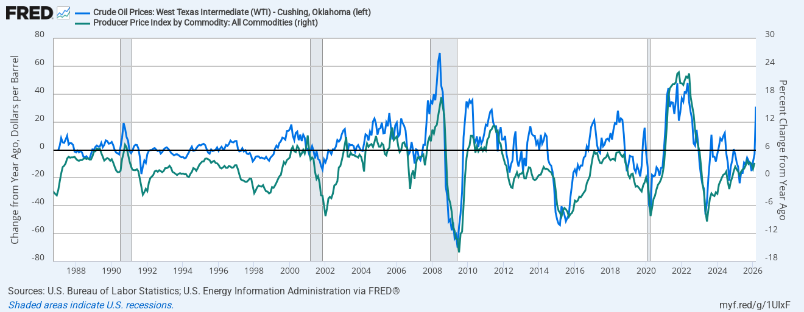

::: callout-note
# On oil prices inflation transmission mechanisms

What brings consumer inflation is actually monetary policy
:::

::: callout-note
# On firms sentiment on for march 2026

The March 2026 PMI releases from S&P Global, together with the GEP Global Supply Chain Volatility Index, point to a clear inflection in the global macro cycle: a transition from modest expansion toward a fragile, shock-driven environment characterized by weakening demand, intensifying cost pressures, and rising risks of stagflation. The common driver across regions is the geopolitical shock stemming from the Middle East conflict, which is propagating through energy prices, supply chains, and expectations.

In the eurozone, the slowdown is already evident in high-frequency activity indicators. The Composite PMI fell to 50.7 (from 51.9), a nine-month low and below its long-run average, signaling near-stagnation. Crucially, the composition of growth has deteriorated. Services—previously the main engine—have nearly stalled (50.2), while manufacturing output remains relatively resilient. This divergence is consistent with a cost-push shock: manufacturing benefits in the short term from order backlogs and inventory adjustments, while services—more sensitive to real income—react faster to the erosion of purchasing power.

Demand dynamics have turned decisively weaker. New orders declined for the first time since mid-2025, led by services, and export demand remains subdued. The deterioration in forward-looking indicators is particularly concerning: business expectations have fallen to near one-year lows, hiring has stalled, and employment has begun to decline modestly. This aligns with a classic transmission channel where uncertainty and margin compression feed into labor demand, reinforcing the slowdown via weaker household income and consumption.

At the same time, price dynamics are moving in the opposite direction. Input cost inflation has surged to a three-year high, with manufacturing input prices recording an especially sharp monthly increase. Services are also experiencing strong cost pressures, suggesting broad-based inflationary forces. However, output price inflation has risen only modestly, indicating limited pass-through. This implies margin compression, a key feature of early stagflationary environments: firms face rising costs but cannot fully transmit them to consumers due to w

Sectoral data reinforce this picture of heterogeneous but weakening activity. Across Europe, only 11 of 19 sectors expanded in March, down from 15 in February. Demand conditions have faltered broadly, with contractions in sectors such as tourism, financials, and real estate. Consumer-facing sectors are particularly weak, reflecting the squeeze on real incomes. At the same time, input price inflation has accelerated across almost all sectors, with energy-intensive industries (e.g., chemicals, transportation) facing the strongest pressures. This combination—weak demand and rising costs—is structurally negative for profitability and investment.

The global supply chain data provide the missing link connecting these developments. The GEP Global Supply Chain Volatility Index surged to a three-year high (0.57), signaling a rapid tightening of supply conditions. The mechanisms are consistent with a negative supply shock: higher energy prices have increased transportation costs (to a four-year high), while maritime disruptions have created bottlenecks and shortages. Notably, shortages are rising despite weakening demand—a clear indication that supply constraints, not demand overheating, are driving inflationary pressures.

Firms’ behavioral responses are amplifying these dynamics. Across regions, companies are engaging in precautionary stockpiling, with inventory accumulation reaching its highest level in three years. This is particularly pronounced in Europe, where firms are building buffers against future disruptions. While rational at the micro level, this behavior exacerbates shortages and pushes costs higher in the aggregate—a classic coordination problem that intensifies supply shocks.

At the same time, input demand for new production is weakening globally, especially in Asia, reflecting caution and uncertainty. This combination—stockpiling of existing inputs but reduced forward purchasing—suggests that firms expect both continued disruptions and weaker final demand. It is a defensive posture consistent with late-cycle dynamics under uncertainty.

In the United States, the picture is more mixed but directionally similar. Sector PMI data show expansion in most sectors, but with a generalized loss of momentum. The key divergence lies in sectoral rotation. Basic Materials and Industrials are relatively strong, benefiting from supply-side dynamics and possibly inventory rebuilding. In contrast, Consumer Services—the most demand-sensitive sector—has contracted sharply, registering its steepest decline since 2022. This mirrors the eurozone pattern, where consumption is weakening under the weight of higher prices.

The cross-country and cross-sector consistency of these patterns strengthens the interpretation of a global cost-push shock with demand spillovers. Energy prices act as the initial impulse, feeding into transportation costs, input prices, and ultimately consumer prices. As real incomes are eroded, demand weakens, particularly in discretionary and service sectors. Firms respond by cutting hiring, reducing investment, and managing inventories more defensively, reinforcing the slowdown.

From a macro-financial perspective, this environment is particularly challenging. The coexistence of weak growth and rising inflation puts central banks in a difficult position. In the eurozone, the acceleration in input costs and gradual pass-through to output prices increase the risk of second-round effects. This is already reflected in a more hawkish stance from the European Central Bank, despite weakening activity. The result is a tightening of financial conditions into a slowdown—an inherently destabilizing combination.

Looking ahead, the key question is whether the shock remains temporary or becomes embedded. If energy prices stabilize and supply chains adjust, the current dynamics could resemble a short-lived supply disruption with limited long-term impact. However, the persistence of geopolitical tensions, combined with feedback loops through expectations, wages, and policy responses, raises the risk of a more prolonged stagflationary phase.

In this context, the decline in business confidence is particularly important. Expectations act as a transmission channel between current shocks and future outcomes. Lower confidence reduces hiring and investment today, which in turn weakens future income and demand. This endogenous amplification mechanism suggests that even if the initial shock fades, its economic impact may persist.

In sum, the March 2026 data point to a synchronized global shift toward slower growth, rising cost pressures, and heightened uncertainty. The eurozone appears especially vulnerable, given its energy exposure and weaker demand dynamics, but similar patterns are emerging in the United States and globally. The interaction between supply shocks, demand erosion, and policy constraints defines the current macro regime—one where risks are tilted toward downside growth surprises and persistent inflationary pressures.
:::